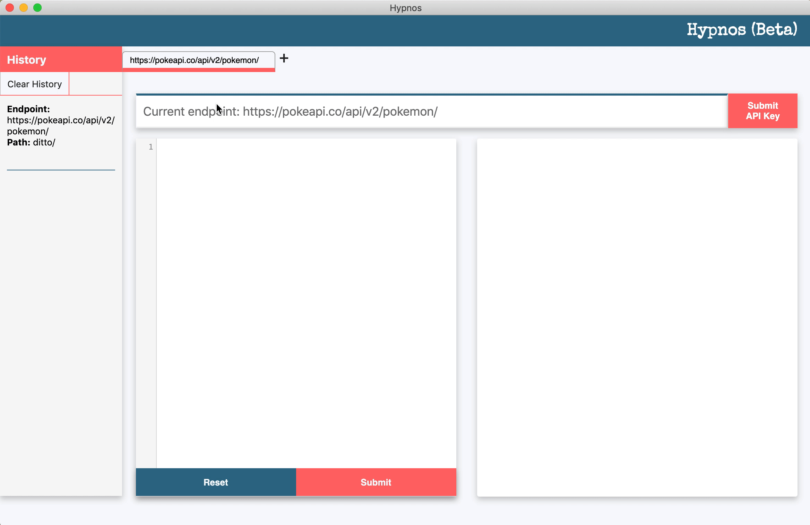
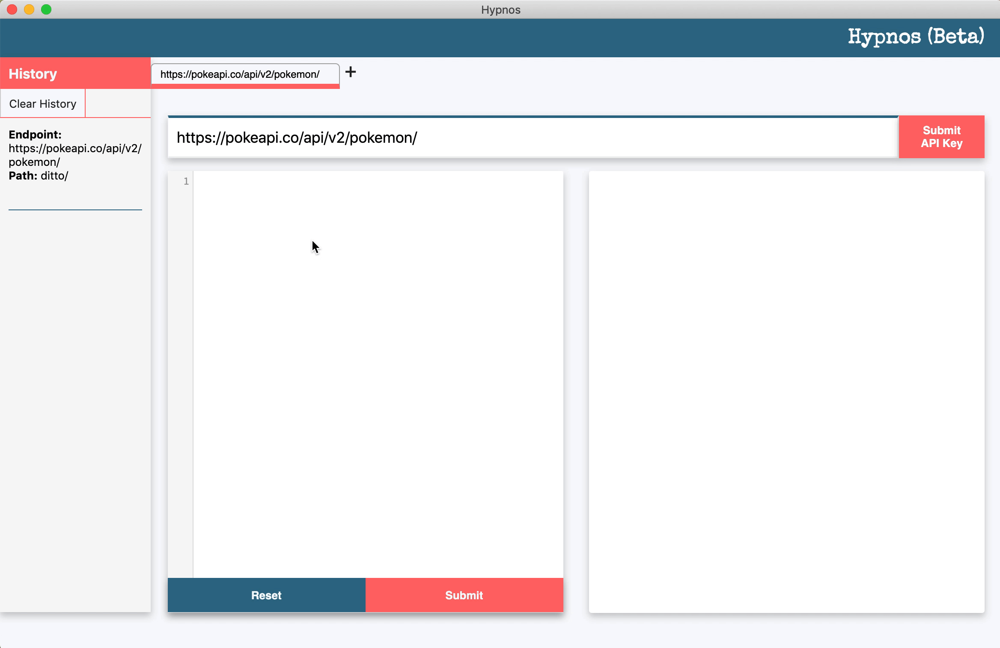
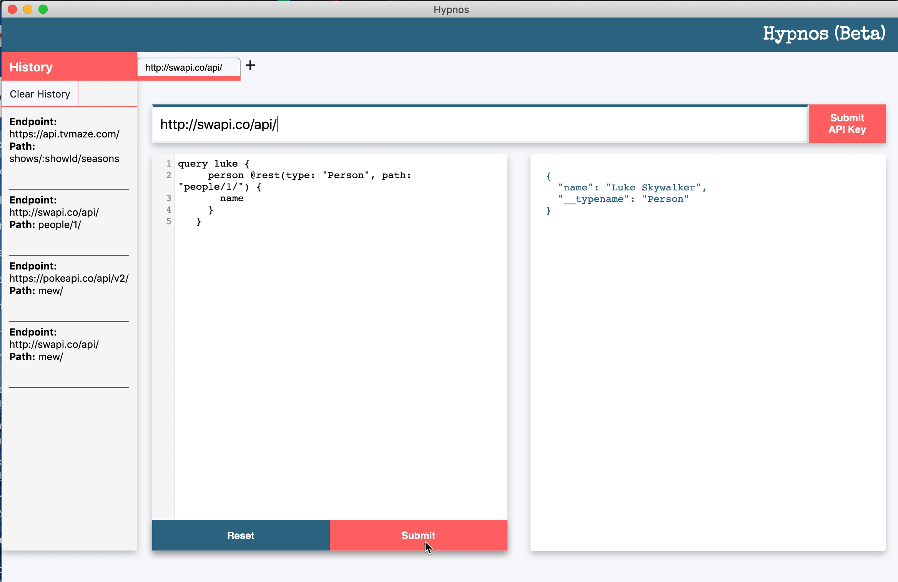

## HYPNOS

Welcome to __Hypnos(beta)__, a streamlined desktop application to sandbox GraphQL calls to RESTful APIs using the Apollo-link-rest package from Apollo Client, as well as giving detailed, helpful error messages. 

<!-- The user can input a RESTful API endpoint, submit an Apollo-link-rest call, and will receive the precise data requested or detailed error messages.  -->

<!-- Hypnos is currently in beta. -->

*\* We recently added tabs to handle multiple entries!* 

## Getting Started

__Requirements__

All you need to do is download your respective OS package, install, and go!

__How to Install__

Download for Mac or Windows (Linux coming soon!)

__Mac__: [hypnos-0.0.1.dmg](https://github.com/oslabs-beta/hypnos/releases/download/v0.0.1/Hypnos-0.0.1.dmg)

__Windows Zipped Config__: [hypnos-0.0.1.zip](https://github.com/oslabs-beta/hypnos/releases/download/v0.0.1/Hypnos-windows.zip)

Install the app to your applications folder.

## How to Use

__Enter your API endpoint__

Hypnos supports calls to both open APIs and APIs requiring a key. Future versions will include support for APIs requiring Basic Auth and Oauth2

__Enter your Apollo-link-rest query__

A sample query is provided. Further documentation on Apollo-link-rest calls can be found in the Apollo GraphQL documents here: <https://www.apollographql.com/docs/link/links/rest/>

__Hypnos will return the GraphQL response or meaningful errors__

If there are any errors in query formatting, they will be displayed on the right

## Features

__Hypnos History__

Hypnos will store your local query history, persisting queries from your sessions. You can delete your entire history, or you can delete individual queries. You also have the option of repopulating the current tab with a previous query. 

__Tabs__

Want to submit another query, but don't want to submit your current query just yet? Just open up a new tab! Hypnos will save the endpoint and query, and you can come back to it later.

__Authenticated APIs__

A majority of APIs require a key in order to gain access to their endpoints, but have no fear: Hypnos supports API keys. Type in your endpoint and query as you would normally, but before you submit the query, go to __Submit API Key__. Clicking on it will open a new window in which you can enter the key for your headers and the API key given to you by the API itself. Once you submit the keys, you can go ahead and submit your query.

## Resources

Built with Electron and React

__Authors__:  [Dillon Garrett](https://github.com/dillon-garrett), [Sophie Nye](https://github.com/SophieNye), [Will Robinson](https://github.com/wrobinson91)
